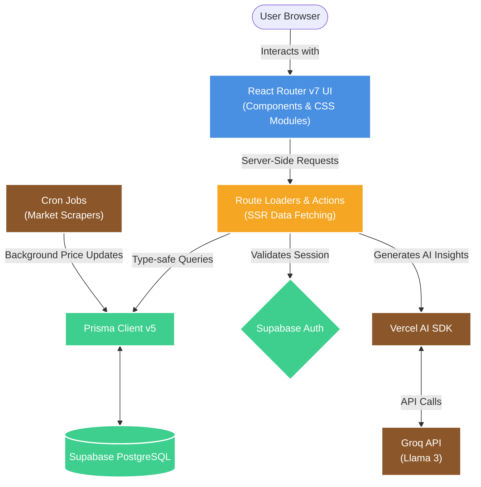

<div align="center">
  <h1>🎯 FlipTrack</h1>
  <p><strong>Your Reselling Empire, Tracked in Real Time.</strong></p>
  
  <p>
    <a href="https://github.com/rushikesh-bobade/FlipTrack/blob/main/LICENSE"></a>
    <a href="https://github.com/rushikesh-bobade/FlipTrack/pulls"></a>
    <a href="https://reactrouter.com/"></a>
    <a href="https://supabase.com/"></a>
    <a href="https://www.typescriptlang.org/"></a>
  </p>

  <p>
    An open-source SaaS platform designed specifically for sneaker, streetwear, and collectibles resellers to manage their inventory, track market prices, and analyze their business using AI. Built for the <strong>Open Source Hackathon by Elite Coders</strong>.
  </p>
</div>

<br />

## 📖 Table of Contents
- [Vision](#-vision)
- [Key Features](#-key-features)
- [Tech Stack Architecture](#-tech-stack-architecture)
- [Getting Started](#-getting-started)
  - [Prerequisites](#prerequisites)
  - [Local Installation](#local-installation)
  - [Database Setup](#database-setup)
- [Demo Credentials](#-demo-credentials)
- [Project Structure](#-project-structure)
- [Contributing](#-contributing)
- [License](#-license)

---

## 🚀 Vision

The reselling market is booming, but resellers often rely on messy spreadsheets and fragmented tools to manage thousands of dollars in inventory. **FlipTrack** unifies the entire workflow into a single, cohesive dashboard. It is a feature-complete, modern alternative to existing premium trackers, fully open-sourced for the community. 

Whether you are flipping 10 pairs a month or running a massive consignment operation, FlipTrack scales with your business logic.

---

## 🌟 Key Features

*   📦 **Comprehensive Inventory Management**
    Track every item with granular details including SKU, size, condition, purchase price, purchase date, and real-time status (`IN_STOCK`, `LISTED`, `SOLD`).
*   📈 **Market Price Intelligence**
    Automated background scraping (via API cron jobs) of real-time market prices across secondary platforms to keep your portfolio valuation accurate.
*   🧠 **Generative AI Insights**
    Powered by the Vercel AI SDK and Groq (Llama 3), FlipTrack analyzes your inventory and provides actionable, data-driven advice on *when* to hold and *when* to sell.
*   💰 **Sales & Expense Tracking**
    Log sales, track platform/shipping fees, and generate detailed P&L (Profit & Loss) statements instantly.
*   🔒 **Enterprise-Grade Authentication**
    Secure login flows utilizing Supabase Auth with strict Server-Side Rendering (SSR) cookie validation.
*   ✨ **Premium Glassmorphic UI**
    A sleek, responsive, and blazing-fast interface built entirely from scratch utilizing raw CSS variables and CSS Modules, guaranteeing zero bloat from heavy UI frameworks.

---

## 🏗️ Tech Stack Architecture

FlipTrack is engineered with a modern, scalable, and fully type-safe stack:

| Layer | Technology | Purpose |
| :--- | :--- | :--- |
| **Framework** | **React Router v7** | Full-stack routing, SSR, and Data Loaders |
| **Language** | **TypeScript** | Strict end-to-end type safety |
| **Database** | **PostgreSQL (Supabase)** | Robust, relational data storage |
| **ORM** | **Prisma Client v5** | Type-safe database queries and schema management |
| **Auth** | **Supabase Auth** | Secure, cookie-based session management |
| **AI Integration** | **Vercel AI SDK + Groq API** | Lightning-fast LLM generation for business insights |
| **Styling** | **Vanilla CSS Modules** | Scoped, collision-free CSS with a robust custom variable theme system |

---

## 🏃 Getting Started

Follow these steps to set up the FlipTrack development environment locally.

### Prerequisites

Ensure you have the following installed and configured on your machine:
*   [Node.js](https://nodejs.org/en/) (v18.x or higher)
*   [Git](https://git-scm.com/)
*   A [Supabase](https://supabase.com/) account (for Postgres DB and Auth)
*   A [Groq](https://console.groq.com/) API key (for AI features)

### Local Installation

1. **Clone the repository**
   ```bash
   git clone https://github.com/rushikesh-bobade/FlipTrack.git
   cd FlipTrack
   ```

2. **Install NPM dependencies**
   ```bash
   npm install
   ```

3. **Configure Environment Variables**
   Create a `.env` file in the root directory based on `.env.example` (if provided), and populate it:
   ```env
   # Supabase Configuration
   NEXT_PUBLIC_SUPABASE_URL="your_supabase_project_url"
   NEXT_PUBLIC_SUPABASE_ANON_KEY="your_supabase_anon_key"
   DATABASE_URL="your_supabase_transaction_pooler_url"
   DIRECT_URL="your_supabase_session_url"
   
   # Groq AI
   GROQ_API_KEY="your_groq_api_key"
   ```

### Database Setup

Sync your Prisma schema with your Supabase Postgres instance and generate the Prisma Client:

```bash
npx prisma db push
npx prisma generate
```

Start the Vite development server:
```bash
npm run dev
```
The application will be running locally at `http://localhost:5173`.

---

## 💡 Demo Credentials

Want to test FlipTrack's UI and features without manually creating data? We have included an automated seed script that provisions a test user and sample sneaker inventory.

1. Ensure your development server is running (`npm run dev`).
2. Execute the demo creation script:
   ```bash
   npx tsx scripts/create-demo-user.ts
   ```
3. Navigate to `http://localhost:5173/auth/login`.
4. Click the **"Use Demo Credentials"** button on the login form to instantly authenticate and view the populated dashboard.

---

## 📁 Architecture Diagram

FlipTrack relies on a highly decoupled but tightly integrated modern tech stack. Below is a high-level overview of how the systems communicate:



---

## 🤝 Contributing

FlipTrack is an open-source project and we welcome contributions from the community! 

Please read our [Contributing Guidelines](CONTRIBUTING.md) and our [Code of Conduct](CODE_OF_CONDUCT.md) before submitting Pull Requests.

1. Fork the Project
2. Create your Feature Branch (`git checkout -b feature/AmazingFeature`)
3. Commit your Changes (`git commit -m 'feat: Add some AmazingFeature'`)
4. Push to the Branch (`git push origin feature/AmazingFeature`)
5. Open a Pull Request

---

## 🛡️ License

This project is licensed under the MIT License - see the [LICENSE](LICENSE) file for details.

<div align="center">
  <i>Built with ❤️ by Rushikesh Bobade and Contributors for the Elite Coders community.</i>
</div>
